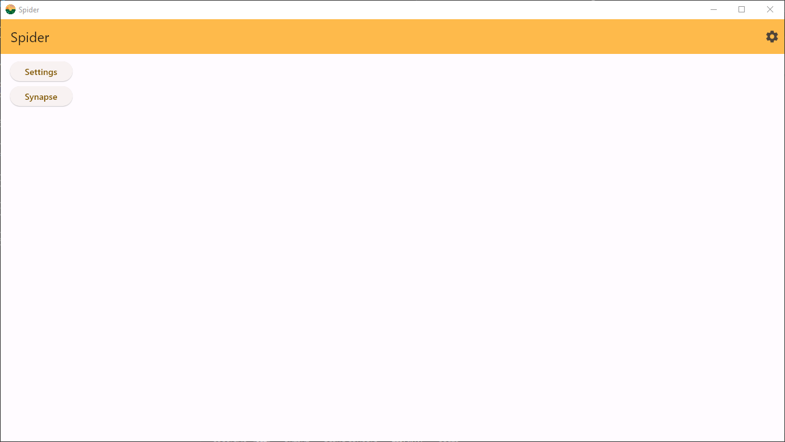
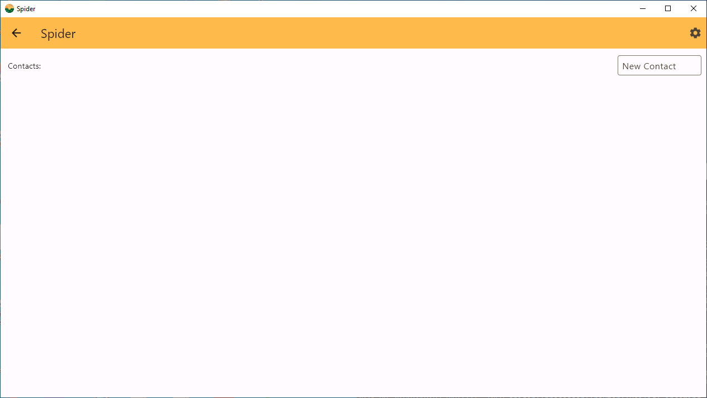
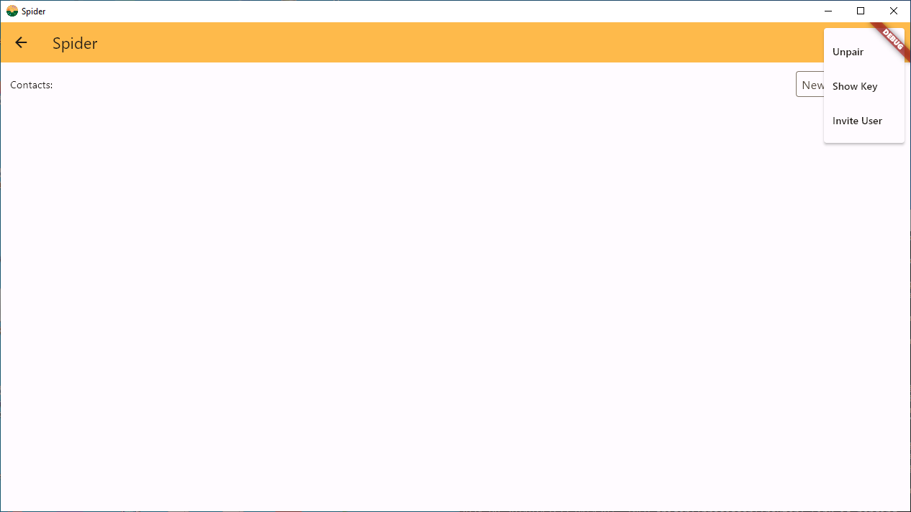
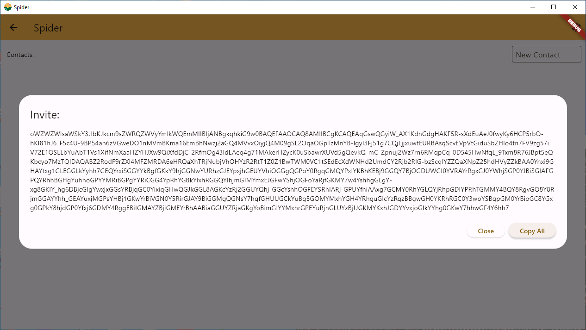
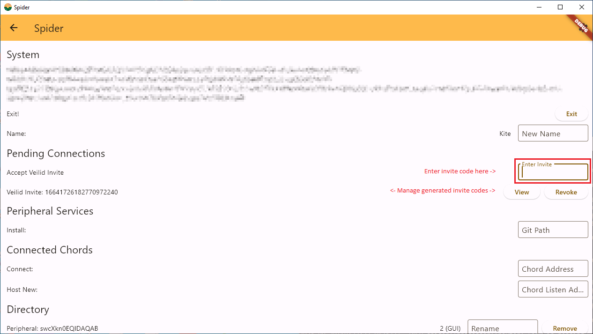
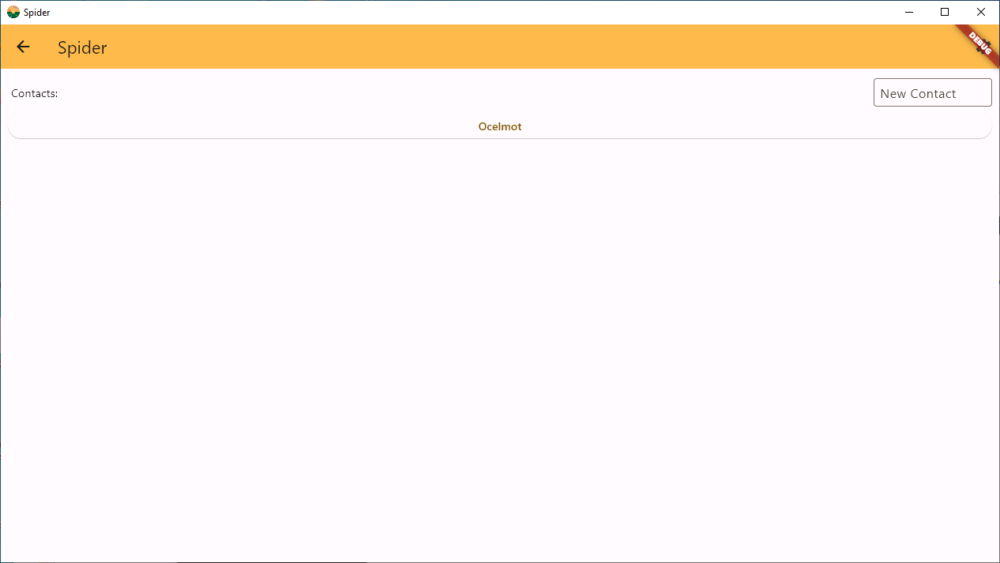
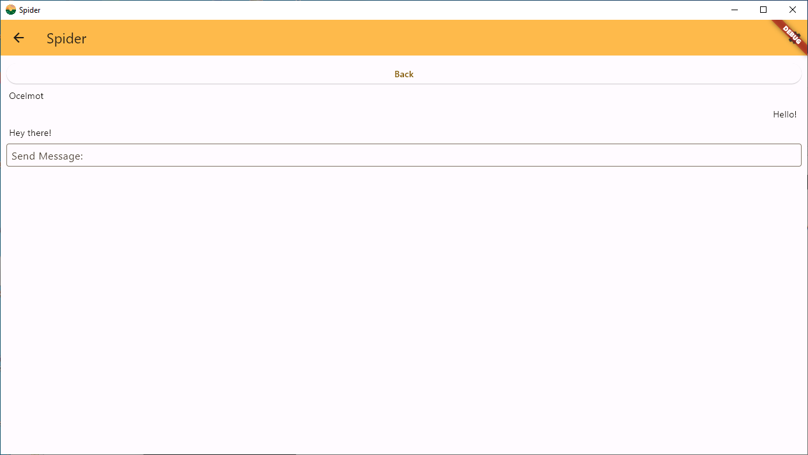

# Synapse

## Installation

Synapse is a simple chat system for the
[Spider](https://github.com/Ocelmot/spider) platform. It is typically installed
via that system rather than as a standalone application. To install through the
Spider platform, first go to the settings menu. It should look like the
following.

Paste the URL for this repo, `https://github.com/Ocelmot/Synapse.git`, into the
box labeled "Git Path" and press enter. The peripheral will install in the
background. 

## Usage

Press the back arrow to return to the list of peripheral pages. Once the
installation is finished, you should see a button for Synapse. It should look
like the image below.

Press the button to enter the page for the peripheral. Since no connections to
other users have been established, the contacts list is empty as shown below.

### Generating an invite code

To connect with another user, first generate an invite code by pressing the gear
icon in the upper right of the screen. This will open a short menu where an
invite code can be generated. 

Press the "Invite User" option and a popup will appear with the invite code that
can then be sent to a friend. Press the copy all button to copy the invite code
to the clipboard. Send the code to a friend.

### Using an invite code

use the arrow at the top left of the screen to return to the main page. Then
press settings to enter the settings page. Paste the invite code into the "Enter
Invite" box and press enter. The system should establish a connection to the
other user's base.

Once connected, the Synapse peripheral page will show the connection in the list
of contacts. Click on the name of the contact to open their chat window. From
this window you can send messages. To return to the list of contacts, press the
back button at the top. To return to the main list of peripherals, press the
arrow at the top left of the screen.

### Contacts and Messages

Once the invite code is completed, the name of the other user will appear in the
list of Synapse contacts. 

Press their name to open the chat screen and send a message.

### Misc

Generated invite codes can be viewed through the settings menu, in case the text
copied to the clipboard is lost. Additionally, they can be revoked if no longer
needed or were sent to the wrong person.

Connections to peers can be revoked or given a nickname in the settings menu by
scrolling down to the heading called "Directory" and pressing the remove button
or entering a new name under the rename box. Connections that are removed will
have to be reinvited to reconnect. Connections that are given a nickname will
show that nickname instead of the device's chosen name whenever appropriate.

